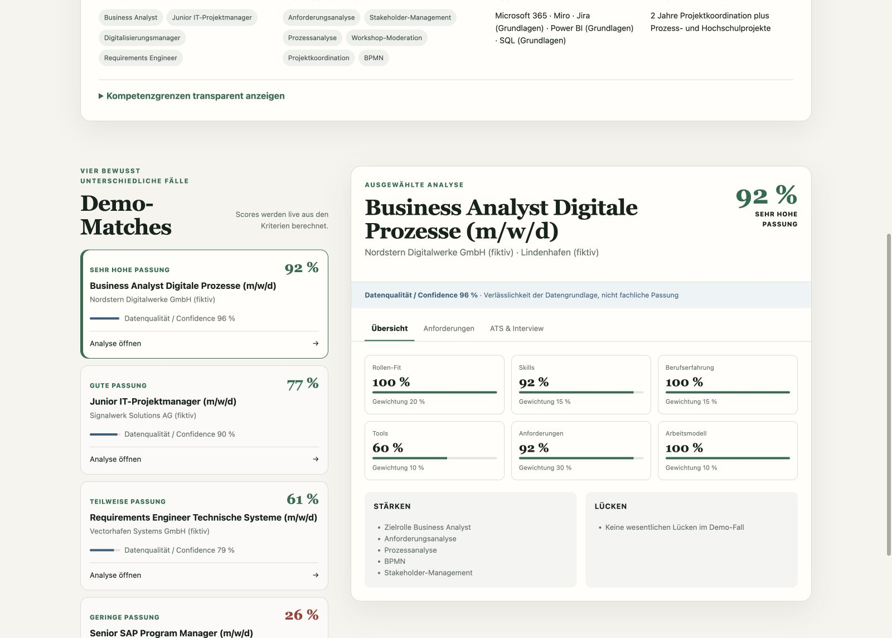
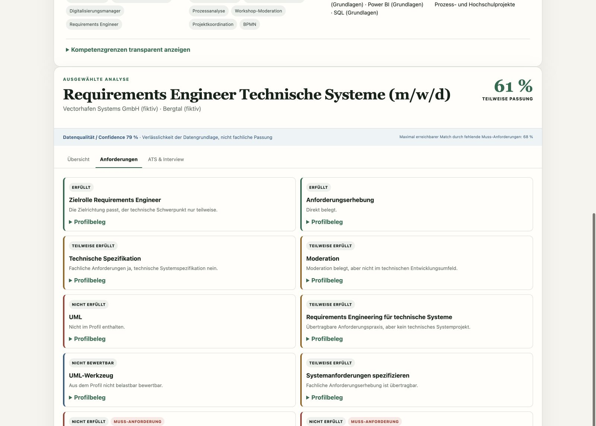
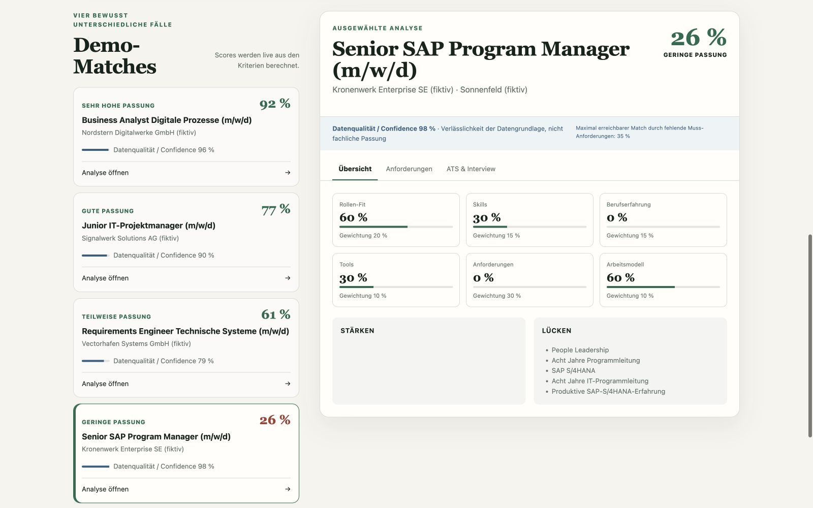

# Jobkompass – Explainable Job Matching Demo

Der Jobkompass ist eine öffentliche Portfolio-Demo für nachvollziehbares
Job-Matching. Die Anwendung vergleicht ein fiktives Kandidatenprofil mit
fiktiven Stellenanforderungen und zeigt nicht nur einen Score, sondern auch die
Belege, Unsicherheiten und Lücken hinter der Bewertung.

> **Portfolio-Hinweis:** Alle Personen, Arbeitgeber, Orte, Stellenanzeigen und
> Bewerbungsinformationen in diesem Repository sind vollständig fiktiv.

## Problemstellung

Viele Job-Matches beruhen hauptsächlich auf ähnlichen Begriffen. Dabei können
wichtige Unterschiede verloren gehen: Grundlagen werden wie Berufspraxis
behandelt, fehlende Informationen werden zu positiv interpretiert und ein hoher
Score bleibt ohne Begründung schwer überprüfbar.

Für Kandidaten und Recruiter entsteht dadurch eine zentrale Frage:

**Warum passt ein Profil zu einer Stelle – und worauf stützt sich diese
Bewertung?**

## Lösung

Der Jobkompass zerlegt die Passung in verständliche Kriterien. Jede positive
oder teilweise positive Bewertung benötigt einen Profilbeleg. Nicht belegte
Anforderungen werden als Lücke oder als nicht zuverlässig bewertbar dargestellt.

So entsteht ein Ergebnis, das fachliche Passung und Qualität der Datengrundlage
bewusst voneinander trennt.

## Kernfunktionen

- erklärbarer Matching Score statt reinem Keyword-Vergleich
- Teilbewertungen für Rolle, Skills, Erfahrung, Tools und weitere Kriterien
- Anforderungen mit verständlichem Erfüllungsstatus
- konkrete Profilbelege zu positiven Bewertungen
- sichtbare Stärken und Kompetenzlücken
- besondere Behandlung von Muss-Anforderungen
- Datenqualität / Confidence als eigene Kennzahl
- ATS-Keyword-Abgleich
- Hinweise für die Interviewvorbereitung
- vier bewusst unterschiedliche Demo-Fälle vom sehr guten Match bis zur klaren
  Fehlpassung

## Beispielablauf

```text
Kandidatenprofil
      ↓
Stellenanzeige
      ↓
Bewertung einzelner Kriterien
      ↓
Matching Score + Datenqualität / Confidence
      ↓
Begründungen und Profilbelege
      ↓
Stärken, Lücken und Interviewvorbereitung
```

## Matching-Logik

Die Demo verwendet eine bewusst einfache, regelbasierte Methode. Sie soll
erklärbar und in einem fachlichen Gespräch nachvollziehbar bleiben.

| Kategorie | Gewicht | Fragestellung |
| --- | ---: | --- |
| Rollen-Fit | 20 % | Entspricht die Aufgabe dem beruflichen Zielbild? |
| Skills | 15 % | Sind die benötigten fachlichen Fähigkeiten belegt? |
| Berufserfahrung | 15 % | Liegt passende praktische Erfahrung vor? |
| Tools | 10 % | Sind geforderte Werkzeuge nachweisbar vorhanden? |
| Fachliche Anforderungen | 30 % | Wie gut werden die konkreten Stellenanforderungen erfüllt? |
| Arbeitsmodell | 10 % | Passt das angebotene Arbeitsmodell zur Präferenz? |

Einzelne Kriterien erhalten intern einen Status:

| Interner Status | Darstellung in der Demo | Bedeutung |
| --- | --- | --- |
| `FULFILLED` | Erfüllt | Ein passender, belastbarer Profilbeleg ist vorhanden. |
| `PARTIALLY_FULFILLED` | Teilweise erfüllt | Es gibt übertragbare oder grundlegende Erfahrung, aber eine erkennbare Lücke bleibt. |
| `NOT_FULFILLED` | Nicht erfüllt | Die Anforderung ist anhand des Profils nicht erfüllt. |
| `UNKNOWN` | Nicht bewertbar | Die Informationen reichen für eine belastbare Bewertung nicht aus. |

`UNKNOWN` ist ausdrücklich nicht dasselbe wie „teilweise erfüllt“. Der Zustand
wird beim fachlichen Score neutraler behandelt als eine klare Lücke, senkt aber
die Datenqualität / Confidence.

Muss-Anforderungen erhalten zusätzlich eine Begrenzungsfunktion: Fehlen
zentrale Muss-Kriterien, kann der Gesamt-Score trotz allgemeiner Ähnlichkeiten
nicht unrealistisch hoch werden.

## Matching Score vs. Datenqualität / Confidence

Die beiden Kennzahlen beantworten unterschiedliche Fragen:

- **Matching Score:** Wie gut passt das Profil fachlich zur Stelle?
- **Datenqualität / Confidence:** Wie vollständig und belastbar sind die
  Informationen, auf denen diese Bewertung beruht?

Eine hohe Confidence bedeutet deshalb nicht automatisch einen guten Match. Im
fiktiven Senior-SAP-Fall liegt der Matching Score nur bei rund **26 %**, während
die Datenqualität etwa **98 %** beträgt. Die vorhandenen Informationen sind sehr
eindeutig – und zeigen verlässlich, dass mehrere Muss-Anforderungen nicht
erfüllt werden.

## Screenshots

Die folgenden vier Screenshots werden nach dem abschließenden Datenschutzcheck
unter `public/screenshots/` ergänzt:

### 1. Produktidee und Projektbeitrag


Zeigt in einem Blick, was der Jobkompass macht, wie Score und Confidence
getrennt werden und worin der eigene Projektbeitrag bestand.

### 2. Jobübersicht und Teil-Scores



Zeigt die vier Passungsstufen und die gewichteten Bewertungskategorien.

### 3. Anforderungen und Profilbelege



Zeigt erfüllte, teilweise erfüllte, nicht erfüllte und nicht bewertbare
Anforderungen sowie Muss-Kriterien und Begründungen.

### 4. Niedrige Passung bei hoher Datenqualität



Zeigt, dass das System ungeeignete Stellen klar erkennt und Confidence nicht
mit fachlicher Passung verwechselt.

## Mein Projektbeitrag

Mein Schwerpunkt lag auf der fachlichen und produktbezogenen Gestaltung:

- Definition des Problems und des Zielbilds
- Anforderungs- und Feature-Definition
- Gestaltung des Workflows vom Profil bis zur begründeten Bewertung
- Definition der Matching-Kategorien, Statuslogik und Gewichtungen
- Festlegung des Umgangs mit Muss-Anforderungen und fehlenden Informationen
- Konzeption der fiktiven Demo-Fälle
- iterative Produktentwicklung und Priorisierung
- Testing, Ergebnisprüfung und Qualitätskontrolle
- Steuerung der technischen Umsetzung mit OpenAI Codex

Das Projekt soll insbesondere Kompetenzen an der Schnittstelle von Business
Analysis, Requirements Engineering, Digitalisierung, Product Ownership,
IT-Projektmanagement und AI-/Automatisierungsprojekten sichtbar machen.

## AI-assisted Development

Die technische Umsetzung wurde im Rahmen von AI-assisted Development mit
OpenAI Codex erstellt. Ich habe Problemstellung, Anforderungen, fachliche Logik,
Produktentscheidungen und Prüfkriterien vorgegeben, die Ergebnisse getestet und
die Umsetzung iterativ gesteuert. Codex wurde für die technische Implementierung
und Überarbeitung eingesetzt.

Das Repository behauptet nicht, dass der gesamte Code manuell von mir
programmiert wurde.

## Technologien

Es werden nur Technologien genannt, die in dieser Demo tatsächlich verwendet
werden:

- HTML5
- CSS3 mit responsivem Layout
- JavaScript als ES Modules
- JSON für fiktive Profile, Jobs und Kriterienbewertungen
- Node.js Built-in Test Runner für automatisierte Tests
- Python Standard Library für den lokalen statischen Webserver
- OpenAI Codex als Werkzeug im AI-assisted-Development-Prozess

Die laufende Demo verwendet keine Datenbank, keine Anmeldung, keine Live-API
und keine externen JavaScript-Bibliotheken.

## Datenschutz

Dieses öffentliche Demo-Projekt ist organisatorisch und technisch von der
privaten Originalanwendung getrennt.

- ausschließlich fiktive Personen und Profile
- ausschließlich fiktive Arbeitgeber, Orte und Stellen
- keine echten Lebensläufe oder Bewerbungsdaten
- keine privaten Suchhistorien, Notizen oder Gehaltsinformationen
- keine Datenbanken, Zugangsdaten, Tokens oder privaten URLs
- keine Git-Historie der privaten Originalversion

Die verbindliche interne Sperrliste befindet sich in
`docs/PRIVACY-BLOCKLIST.md`.

## Lokal starten

Voraussetzung ist eine lokale Python-3-Installation. Im Projektordner ausführen:

```bash
python3 -m http.server 4173
```

Danach im Browser öffnen:

```text
http://127.0.0.1:4173/
```

Es werden keine Besucherdaten gespeichert und keine externen APIs aufgerufen.

## Tests

Die Tests prüfen unter anderem:

- Gewichtung und Berechnung der vier vorgesehenen Matching-Szenarien
- Behandlung von Muss-Anforderungen und `UNKNOWN`
- erforderliche Begründungen und Profilbelege
- Darstellung aller vier Jobs und berechneten Scores
- Trennung von Matching Score und Datenqualität / Confidence
- Statusdarstellung, Jobdetails und Portfolio-Hinweise
- ausschließlich fiktive Daten ohne externe Stellen-URLs

Mit einer vorhandenen Node.js-Laufzeit ausführen:

```bash
node --test tests/*.test.mjs
```

## Projektstatus

Die Demo ist lokal funktionsfähig. Screenshots sowie der abschließende Privacy-
und Security-Check wurden erfolgreich durchgeführt. Das Projekt ist für die
Veröffentlichung als GitHub-Portfolio-Demo vorbereitet.
